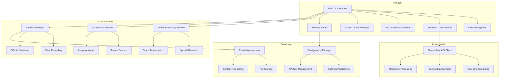

# Design Document

## Overview

Clue Daddy is a sophisticated AI-powered desktop assistant built with Python and PySide6 that provides real-time assistance during meetings, interviews, presentations, and other scenarios. The application features a modern dark theme with smooth animations, real-time audio processing, screenshot analysis, and comprehensive session management. The system integrates with Google's Gemini Live API (gemini-live-2.5-flash-preview) to deliver contextual, intelligent responses based on voice input and visual content.

## Architecture

### High-Level Architecture



### Technology Stack

- **Frontend Framework**: PySide6 (Qt6) for cross-platform GUI
- **Theme System**: pyqtdarktheme for modern dark UI
- **Icons**: qtawesome for FontAwesome and Material Design icons
- **Audio Processing**: sounddevice for real-time audio capture
- **Speech Recognition**: Google Speech-to-Text API integration
- **Screenshot Capture**: mss for fast cross-platform screen capture
- **Database**: SQLite3 (built-in) for local data storage
- **PDF Generation**: reportlab for session export
- **OCR Processing**: pytesseract + pdf2image for document text extraction
- **AI Integration**: Google GenAI Python SDK for Gemini Live API
- **Animations**: Qt Property Animation system

## Components and Interfaces

### 1. Application Core (`app.py`)

**Purpose**: Main application entry point and lifecycle management

**Key Responsibilities**:
- Application initialization and configuration loading
- Window management and routing between different interfaces
- Global hotkey registration and handling
- System tray integration (optional)

**Interface**:
```python
class ClueDaddyApp(QApplication):
    def __init__(self):
        # Initialize Qt application
        # Load configuration
        # Setup global services
        
    def show_onboarding(self) -> None:
        # Display first-time setup
        
    def show_main_gui(self) -> None:
        # Display main interface
        
    def register_global_hotkeys(self) -> None:
        # Setup system-wide shortcuts
```

### 2. Onboarding System (`onboarding/`)

**Purpose**: First-time user setup and configuration

**Components**:
- `welcome_dialog.py`: Welcome screen with title and subtitle
- `api_key_input.py`: Gemini API key collection
- `personal_context_input.py`: User context and resume input
- `onboarding_controller.py`: Flow management and data validation

**Interface**:
```python
class OnboardingController:
    def start_onboarding(self) -> None:
        # Begin setup flow
        
    def validate_api_key(self, key: str) -> bool:
        # Test API key validity
        
    def save_configuration(self, config: dict) -> None:
        # Persist setup data
        
    def complete_onboarding(self) -> None:
        # Finalize and redirect to main GUI
```

### 3. Main GUI Interface (`main_gui/`)

**Purpose**: Central hub for all application features

**Components**:
- `main_window.py`: Primary interface with four main buttons
- `past_sessions_chat.py`: AI chat about previous sessions
- `button_handlers.py`: Navigation and action management

**Interface**:
```python
class MainWindow(QMainWindow):
    def __init__(self):
        # Setup UI layout
        # Initialize past sessions chat
        
    def start_cheating_clicked(self) -> None:
        # Navigate to profile selection
        
    def past_sessions_clicked(self) -> None:
        # Open sessions management
        
    def context_base_clicked(self) -> None:
        # Open profile management
        
    def settings_clicked(self) -> None:
        # Open settings panel
```

### 4. Assistant System (`assistant/`)

**Purpose**: Core AI interaction and real-time assistance

**Components**:
- `profile_selector.py`: Profile selection interface
- `chat_window.py`: Floating assistant chat interface
- `audio_processor.py`: Real-time audio capture and processing
- `screenshot_manager.py`: Periodic screen capture
- `gemini_client.py`: AI API integration

**Interface**:
```python
class AssistantChatWindow(QWidget):
    def __init__(self, profile: Optional[Profile] = None):
        # Setup floating window
        # Initialize AI client with profile context
        
    def start_audio_monitoring(self) -> None:
        # Begin voice detection
        
    def start_screenshot_capture(self) -> None:
        # Begin periodic screen capture
        
    def send_user_message(self, message: str, screenshot: Optional[bytes] = None) -> None:
        # Send manual user input with optional screenshot
        
    def process_voice_input(self, audio_data: bytes) -> None:
        # Handle detected speech
```

### 5. Session Management (`sessions/`)

**Purpose**: Recording, storage, and retrieval of interaction history

**Components**:
- `session_recorder.py`: Real-time data capture
- `session_database.py`: SQLite operations
- `session_viewer.py`: Past sessions interface
- `session_exporter.py`: PDF generation

**Interface**:
```python
class SessionManager:
    def create_session(self, profile_id: Optional[str] = None) -> str:
        # Generate new session UUID
        
    def record_voice_interaction(self, session_id: str, transcript: str, ai_response: str) -> None:
        # Store voice-based interaction
        
    def record_user_prompt(self, session_id: str, prompt: str, screenshot: bytes, ai_response: str) -> None:
        # Store manual user interaction
        
    def finalize_session(self, session_id: str) -> None:
        # Complete and save session
```

### 6. Profile Management (`profiles/`)

**Purpose**: Context profiles for different use cases with comprehensive data integration

**Components**:
- `profile_manager.py`: CRUD operations for profiles
- `profile_editor.py`: Profile creation and editing interface with tabbed layout
- `file_processor.py`: Document handling and OCR for PDFs and images
- `perplexity_integration.py`: Research question generation and API integration
- `context_builder.py`: System prompt construction from all profile data

**Interface**:
```python
class ProfileManager:
    def create_profile(self, name: str, profile_type: str) -> Profile:
        # Create new context profile with all required fields
        
    def update_profile_purpose(self, profile_id: str, purpose: str) -> None:
        # Update profile purpose description
        
    def update_profile_behavior(self, profile_id: str, behavior_instructions: str) -> None:
        # Update specific behavior instructions
        
    def update_profile_context(self, profile_id: str, additional_context: str) -> None:
        # Update additional context text area
        
    def add_file_to_profile(self, profile_id: str, file_path: str) -> None:
        # Process and store profile files with OCR
        
    def conduct_perplexity_research(self, profile_id: str, question: str) -> PerplexityResult:
        # Use Perplexity API for research and return structured result
        
    def append_research_to_context(self, profile_id: str, research: PerplexityResult) -> None:
        # Automatically append research results to profile context
        
    def build_system_prompt(self, profile: Profile) -> str:
        # Construct comprehensive AI system prompt from all profile data
        
class PerplexityClient:
    def __init__(self, api_key: str):
        # Initialize Perplexity API client
        
    def ask_question(self, question: str) -> PerplexityResult:
        # Send question to Perplexity and return structured response
        
    def validate_api_key(self) -> bool:
        # Test API key validity
        
@dataclass
class PerplexityResult:
    question: str
    answer: str
    sources: List[str]
    timestamp: datetime
    
    def format_for_context(self) -> str:
        # Format research result for inclusion in profile context
```

### 7. Configuration System (`config/`)

**Purpose**: Settings management and persistence

**Components**:
- `settings_manager.py`: Configuration CRUD operations
- `settings_ui.py`: Settings interface with tabs
- `config_validator.py`: Input validation and defaults

**Interface**:
```python
class SettingsManager:
    def load_config(self) -> dict:
        # Load from ~/.clue-daddy/config.json
        
    def save_config(self, config: dict) -> None:
        # Persist configuration changes
        
    def get_default_config(self) -> dict:
        # Return default settings
        
    def validate_config(self, config: dict) -> bool:
        # Validate configuration integrity
```

## Data Models

### Configuration Schema

```python
@dataclass
class AppConfig:
    # General Settings
    gemini_api_key: str
    perplexity_api_key: str
    personal_context: str
    default_profile_id: Optional[str]
    launch_at_startup: bool
    
    # Appearance Settings
    accent_color: str = "#00BCD4"  # Teal default
    font_size_multiplier: float = 1.0
    default_transparency: float = 0.65
    enable_animations: bool = True
    
    # AI Settings
    model_name: str = "gemini-live-2.5-flash-preview"
    temperature: float = 0.7
    max_tokens: int = 1000
    universal_system_prompt: str
    enable_search_tool: bool = True
    
    # Hotkeys
    start_cheating_hotkey: str = "Ctrl+Shift+Space"
    transparency_up_hotkey: str = "Ctrl+Alt+Up"
    transparency_down_hotkey: str = "Ctrl+Alt+Down"
    quick_screenshot_hotkey: str = "Ctrl+Alt+S"
    
    # Privacy & Data
    screenshot_frequency_seconds: int = 2
    auto_delete_sessions_days: Optional[int] = None
```

### Profile Schema

```python
@dataclass
class Profile:
    id: str
    name: str
    profile_type: str  # interview, sales, meeting, presentation, negotiation, exam
    description: str
    purpose: str  # Detailed purpose description for the profile
    behavior_instructions: str  # Specific behavior and response instructions
    additional_context: str  # Free-form text area for manual context
    custom_system_prompt: Optional[str]  # Optional system prompt override
    files: List[ProfileFile]
    perplexity_research: List[PerplexityResearch]  # Research conducted for this profile
    created_at: datetime
    updated_at: datetime
    accent_color: str

@dataclass
class ProfileFile:
    id: str
    profile_id: str
    filename: str
    file_path: str
    mime_type: str
    extracted_text: Optional[str]  # For PDFs and images via OCR
    uploaded_at: datetime

@dataclass
class PerplexityResearch:
    id: str
    profile_id: str
    question: str
    answer: str
    sources: List[str]  # Source URLs and citations
    conducted_at: datetime
    appended_to_context: bool  # Whether this research was added to additional_context
```

### Session Schema

```python
@dataclass
class Session:
    id: str  # UUID
    profile_id: Optional[str]
    title: str  # Auto-generated from first interaction
    start_time: datetime
    end_time: Optional[datetime]
    duration_seconds: Optional[int]
    tags: List[str]
    
@dataclass
class SessionInteraction:
    id: str
    session_id: str
    timestamp: datetime
    interaction_type: str  # voice, user_prompt
    content: str  # Transcript or user message
    ai_response: str
    screenshot_path: Optional[str]
    audio_path: Optional[str]  # For voice interactions
```

### Database Schema (SQLite)

```sql
-- Configuration table
CREATE TABLE config (
    key TEXT PRIMARY KEY,
    value TEXT NOT NULL,
    updated_at TIMESTAMP DEFAULT CURRENT_TIMESTAMP
);

-- Profiles table
CREATE TABLE profiles (
    id TEXT PRIMARY KEY,
    name TEXT NOT NULL,
    profile_type TEXT NOT NULL,
    description TEXT,
    purpose TEXT,
    behavior_instructions TEXT,
    additional_context TEXT,
    custom_system_prompt TEXT,
    accent_color TEXT DEFAULT '#00BCD4',
    created_at TIMESTAMP DEFAULT CURRENT_TIMESTAMP,
    updated_at TIMESTAMP DEFAULT CURRENT_TIMESTAMP
);

-- Profile files table
CREATE TABLE profile_files (
    id TEXT PRIMARY KEY,
    profile_id TEXT NOT NULL,
    filename TEXT NOT NULL,
    file_path TEXT NOT NULL,
    mime_type TEXT NOT NULL,
    extracted_text TEXT,
    uploaded_at TIMESTAMP DEFAULT CURRENT_TIMESTAMP,
    FOREIGN KEY (profile_id) REFERENCES profiles (id) ON DELETE CASCADE
);

-- Sessions table
CREATE TABLE sessions (
    id TEXT PRIMARY KEY,
    profile_id TEXT,
    title TEXT NOT NULL,
    start_time TIMESTAMP NOT NULL,
    end_time TIMESTAMP,
    duration_seconds INTEGER,
    tags TEXT, -- JSON array
    created_at TIMESTAMP DEFAULT CURRENT_TIMESTAMP,
    FOREIGN KEY (profile_id) REFERENCES profiles (id) ON DELETE SET NULL
);

-- Session interactions table
CREATE TABLE session_interactions (
    id TEXT PRIMARY KEY,
    session_id TEXT NOT NULL,
    timestamp TIMESTAMP NOT NULL,
    interaction_type TEXT NOT NULL,
    content TEXT NOT NULL,
    ai_response TEXT NOT NULL,
    screenshot_path TEXT,
    audio_path TEXT,
    FOREIGN KEY (session_id) REFERENCES sessions (id) ON DELETE CASCADE
);

-- Perplexity research table
CREATE TABLE perplexity_research (
    id TEXT PRIMARY KEY,
    profile_id TEXT NOT NULL,
    question TEXT NOT NULL,
    answer TEXT NOT NULL,
    sources TEXT, -- JSON array of source URLs
    conducted_at TIMESTAMP DEFAULT CURRENT_TIMESTAMP,
    appended_to_context BOOLEAN DEFAULT FALSE,
    FOREIGN KEY (profile_id) REFERENCES profiles (id) ON DELETE CASCADE
);
```

## Error Handling

### Error Categories

1. **API Errors**: Gemini API failures, rate limiting, authentication issues
2. **Audio Errors**: Microphone access, audio processing failures
3. **File System Errors**: Permission issues, disk space, file corruption
4. **Database Errors**: SQLite connection issues, schema problems
5. **Network Errors**: Internet connectivity, proxy issues

### Error Handling Strategy

```python
class ClueDaddyError(Exception):
    """Base exception for Clue Daddy application"""
    pass

class APIError(ClueDaddyError):
    """Gemini API related errors"""
    pass

class AudioError(ClueDaddyError):
    """Audio processing related errors"""
    pass

class DatabaseError(ClueDaddyError):
    """Database operation errors"""
    pass

# Error handling with user-friendly messages
def handle_error(error: Exception, context: str) -> None:
    logger.error(f"Error in {context}: {error}")
    
    if isinstance(error, APIError):
        show_error_dialog("AI Service Error", 
                         "Unable to connect to AI service. Please check your API key and internet connection.")
    elif isinstance(error, AudioError):
        show_error_dialog("Audio Error", 
                         "Unable to access microphone. Please check your audio permissions.")
    # ... other error types
```

## Testing Strategy

### Unit Testing

- **Components**: Test individual UI components, data models, and utility functions
- **Services**: Mock external dependencies (APIs, file system) for isolated testing
- **Database**: Use in-memory SQLite for fast, isolated database tests

### Integration Testing

- **API Integration**: Test Gemini API client with real API calls (using test API key)
- **Audio Pipeline**: Test audio capture → speech recognition → AI response flow
- **File Processing**: Test PDF OCR, file upload, and storage operations

### UI Testing

- **Automated UI Tests**: Use Qt Test framework for widget interaction testing
- **Manual Testing**: User acceptance testing for complex workflows
- **Performance Testing**: Test with large session histories and multiple profiles

### Test Structure

```python
# tests/
├── unit/
│   ├── test_models.py
│   ├── test_session_manager.py
│   ├── test_profile_manager.py
│   └── test_config_manager.py
├── integration/
│   ├── test_gemini_client.py
│   ├── test_audio_pipeline.py
│   └── test_database_operations.py
└── ui/
    ├── test_main_window.py
    ├── test_assistant_window.py
    └── test_settings_dialog.py
```

## Profile System Prompt Integration

### Comprehensive Context Building

When a profile is selected for use with the AI assistant, the system constructs a comprehensive context by combining all profile data:

```python
def build_comprehensive_system_prompt(profile: Profile, universal_prompt: str) -> str:
    """
    Build complete system prompt combining universal prompt with all profile data
    """
    context_sections = []
    
    # Start with universal system prompt
    context_sections.append(universal_prompt)
    
    # Add profile-specific sections
    if profile.purpose:
        context_sections.append(f"**PROFILE PURPOSE:**\n{profile.purpose}")
    
    if profile.behavior_instructions:
        context_sections.append(f"**BEHAVIOR INSTRUCTIONS:**\n{profile.behavior_instructions}")
    
    if profile.additional_context:
        context_sections.append(f"**ADDITIONAL CONTEXT:**\n{profile.additional_context}")
    
    # Add file contents
    if profile.files:
        file_contents = []
        for file in profile.files:
            if file.extracted_text:
                file_contents.append(f"**FILE: {file.filename}**\n{file.extracted_text}")
        if file_contents:
            context_sections.append("**UPLOADED FILES:**\n" + "\n\n".join(file_contents))
    
    # Add Perplexity research
    if profile.perplexity_research:
        research_contents = []
        for research in profile.perplexity_research:
            sources_text = "\nSources: " + ", ".join(research.sources) if research.sources else ""
            research_contents.append(f"**RESEARCH: {research.question}**\n{research.answer}{sources_text}")
        if research_contents:
            context_sections.append("**RESEARCH FINDINGS:**\n" + "\n\n".join(research_contents))
    
    # Combine all sections
    full_prompt = "\n\n".join(context_sections)
    
    # Always end with the ready message instruction
    full_prompt += "\n\nI'm ready to help!"
    
    return full_prompt
```

### Profile Tab Structure

The Profile Editor provides a comprehensive interface with the following tabs:

1. **Overview Tab**: Basic profile information (name, type, description, accent color)
2. **Purpose & Behavior Tab**: 
   - Purpose description field (what this profile is for)
   - Behavior instructions field (how the AI should behave)
3. **Context Tab**: 
   - Large text area for additional context
   - Automatically appended Perplexity research results
4. **Files Tab**: 
   - Drag-and-drop file upload
   - Automatic OCR for PDFs and images
   - File management and preview
5. **Perplexity Research Tab**:
   - Question input field
   - Research history display
   - Automatic context integration

## Security Considerations

### API Key Management

- Store both Gemini and Perplexity API keys encrypted using system keyring
- Never log or display API keys in plain text
- Validate API key format and test connectivity before storage
- Gracefully handle missing Perplexity API key by disabling research features
- Provide clear error messages when API keys are invalid or missing

### Data Privacy

- All session data stored locally (no cloud storage)
- Provide clear data deletion options
- Encrypt sensitive profile information

### Audio Privacy

- Audio processing happens locally when possible
- Clear indication when audio is being recorded
- Option to disable audio monitoring

### File Security

- Validate file types and sizes before processing
- Sandbox file operations to prevent directory traversal
- Secure deletion of temporary files

## Performance Optimization

### Audio Processing

- Use efficient audio buffers and streaming
- Implement voice activity detection to reduce API calls
- Cache speech recognition results

### Screenshot Management

- Compress screenshots to reduce storage
- Implement cleanup for old screenshots
- Optimize screenshot frequency based on activity

### Database Performance

- Index frequently queried columns
- Implement pagination for large session lists
- Use connection pooling for concurrent operations

### Memory Management

- Implement proper cleanup for Qt objects
- Use weak references where appropriate
- Monitor memory usage in long-running sessions

## Deployment and Distribution

### Packaging Strategy

- Use PyInstaller for creating standalone executables
- Include all required dependencies and assets
- Create platform-specific installers (Windows MSI, macOS DMG)

### Directory Structure

```
~/.clue-daddy/
├── config.json
├── database.db
├── sessions/
│   └── <session-uuid>/
│       ├── transcript.json
│       ├── screenshots/
│       └── audio/
├── profiles/
│   └── <profile-id>/
│       └── files/
└── logs/
    └── app.log
```

### Auto-Update System

- Check for updates on startup (optional)
- Download and apply updates safely
- Backup user data before updates

This design provides a comprehensive foundation for building Clue Daddy as a sophisticated, user-friendly AI assistant that balances powerful functionality with privacy and performance considerations.